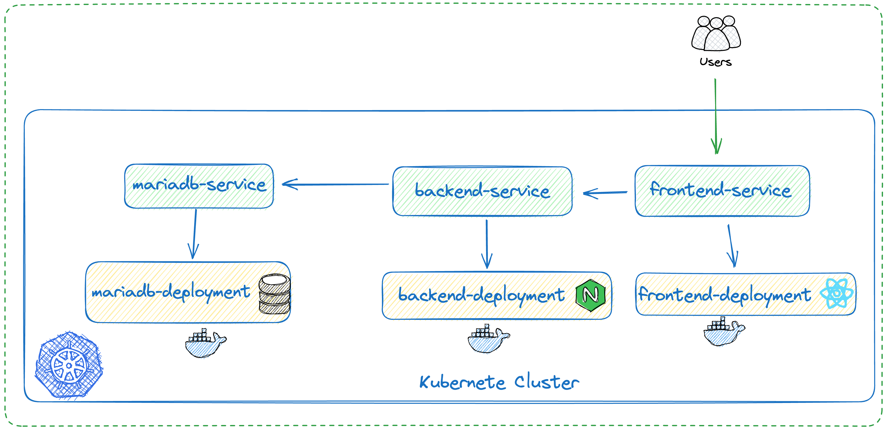

# Kubernetes 101 challenge.

A small startup is developing a product that initially uses 3 layers (frontend, backend, database) and requires its infrastructure experts to deploy this solution on Kubernetes fulfilling some requirements

## **Kubernetes Workflow**  



## **Requirements**
### **Database**

- The database must be MariaDB, and must be exposed with a Kubernetes service type clusterIP on port 3306
- The database must receive as environment variables the following variables (sensitive variables must be referenced as a secret):
    - MYSQL_USER
    - MYSQL_ROOT_PASSWORD
    - MYSQL_DATABASE
    - MYSQL_PASSWORD
- configure the liveness and readiness probe in the database deployment with the following command: ```healthcheck.sh --connect --innodb_initialized```

### **Backend**

- The backend must have 3 replicas, each replica must run on different nodes.
- The backend must reference the database domain as an environment variable, as well as the password and the database name.
    - DB_PORT
    - DB_PASSWORD
    - DB_HOST
    - DB_NAME
- The backend must be exposed with a Kubernetes-service so that it can be consumed from the frontend
- Configure The liveness in the backend to know if the pod is healthy

### **Frontend**

- Frontend must have 2 replicas, it must run on the nodes that have the label:
    - tier: frontend
- Check why the frontend can only consume the backend by the address [http://localhost:3001](http://localhost:3001/) and make recommendations on how another address can be used.

### Considerations

- The backend exposes port 3001, frontend exposes port 3000.
- It is possible to use kubectl port-forward if the cluster runs locally.
- all components must be deployed in ```develop``` namespace
